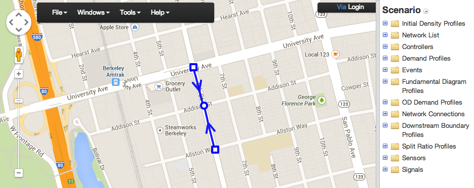
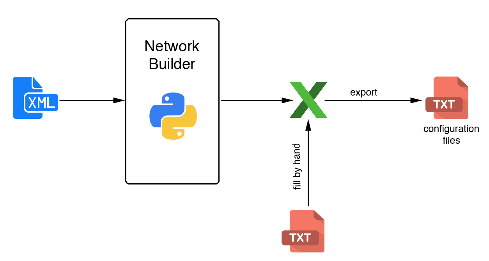

============================
First Step: Configuration Files
============================

:date: 2014-08-14 16:30
:tags: pointq, simulator
:author: Martin Gouy

Introduction
============

The goal of this section is to present the different methods available to generate the configuration files needed to run the simulation.

Files needed
========

The list of the different files needed by the simulation is the following:

* **Network Configuration files**
	* fi_demand_param_entry_link.txt
	* fi_id_all_network_link_id_orig_dest_node_length_link_capacity_link_param_travel_duration.txt
	* fi_id_all_phases_max_queue_size_sat_flow_queue_type.txt
	* fi_id_entry_exit_lk_related_path.txt
	* fi_id_internal_link_id_orig_dest_node.txt
	* fi_id_link_id_sublinks.txt
	* fi_id_node_id_entering_links_to_node.txt
	* fi_id_node_id_entry_links_to_network.txt
	* fi_id_node_id_exit_links_from_network.txt
	* fi_id_node_id_leaving_links_from_node.txt
	* fi_id_node_type_node.txt
	* fi_init_state_que.txt
	* fi_mod_cum.txt
	* fi_mrp.txt
	* fi_mrp_cum.txt
	* fi_phase_interference.txt
	* fi_presence_detector.txt
	* fi_que_size_detector.txt
	* fi_series_cum_val_varying_rp.txt
	* fi_series_varying_rp.txt
	* fi_stages_each_non_sign_inters.txt
	* fi_stages_each_sign_inters.txt

* **Control Configuration files**
	* fi_node_id_ctrl_type_category.txt
	* files needed to define the type of control (FT/MP)

The specification of each of these files is available in the LaTex documentation available in the Github page of the project.

First method: Generate the files from the XML of the network
===================================

This method consist in representing the network thanks to an XML file, and then extract the info from the XML with a python program to create most of the required configuration files (some still need to be filled by hand).

Create the XML file for your network
------------------------------

You can use this `Scenario Editor <https://gateway.path.berkeley.edu/scenario-editor-0.4-no-drag/app/main.html#>`_ to create your network and export it to XML.

Structure of the XML file
------------------------------

The minimal structure of the XML should be the following:

.. code-block:: xml

	<NetworkSet>
		<network>
			<NodeList>
				<node id="10001" in_sync="false" node_name="Huntington Dr & 210 WB Off-Ramp">
					<outputs>
						<output link_id="100054"/>
						<output link_id="200037"/>
						<output link_id="200053"/>
					</outputs>
					<inputs>
						<input link_id="100037"/>
						<input link_id="100053"/>
						<input link_id="200054"/>
					</inputs>
					<position>
						<point elevation="0" lat="34.1402560877304" lng="-118.016007095575"/>
					</position>
				</node>
			</NodeList>
			<LinkList>
				<link id="10002" in_sync="true" lane_offset="0" lanes="2" length="49.0728">
					<begin node_id="100016"/>
					<end node_id="10002"/>
					<position>
						<point elevation="0" lat="34.1402927661392" lng="-118.01804959774"/>
						<point elevation="0" lat="34.14027" lng="-118.01873"/>
						<point elevation="0" lat="34.14022" lng="-118.01873"/>
						<point elevation="0" lat="34.140220557247" lng="-118.018722832203"/>
					</position>
					<shape>u_koEnpioU?b@@rC</shape>
				</link>
			</LinkList>
		</network>
	</NetworkSet>

How to generate the configuration files from the XML
--------------------------------------------------------

How to proceed:

#. Put your xml in the same folder than "network_configuration.py" located in the XML_TOOLS folder (cf Github of the project). 
#. Run "network_configuration.py". The output is an excel workbook.
	**Info:** some of the configuration files are not generated automatically by this program. You will have to fill them by hand.
#. Fill the uncompleted spreadsheets by hand
#. Export the spreadsheets with excel to .txt with tabulations format 

Second method: Create the files by hand
===================================

This method should only be used for very small networks. It's a very painful method which will probably produce a lot of errors and make you loose some time to debug the mistakes.
