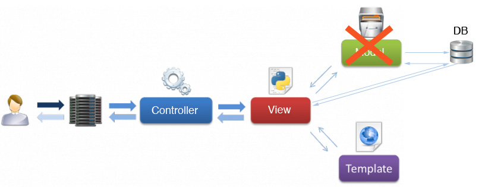

============================
Website: Further information
============================

:date: 2014-08-14 16:30
:tags: pointq, simulator
:author: Martin Gouy

Framework
============
The website runs under a web framework called Django which uses Python. This choice has been made for multiple reasons:

* Clean structure
* Modularity
* Well documented and big community
* Django is a python-based framework. The simulator is coded in Python, therefore it's good to maintain the same environment in case for example we want to control the simulation from the website.

More info / documentation can be found on `Django Website <https://www.djangoproject.com/>`_ .

**Note:** Their `tutorial  <https://docs.djangoproject.com/en/1.6/intro/tutorial01/>`_ is very well built and it is an easy way to get familiar with Django.

Design Choices
==================

The recommended schema for a Django application is called `MVT <https://docs.djangoproject.com/en/dev/faq/general/#django-appears-to-be-a-mvc-framework-but-you-call-the-controller-the-view-and-the-view-the-template-how-come-you-don-t-use-the-standard-names/>`_ (Model/View/Template). However, for our application we decided to get rid of the Model part by connecting directly to the database.

Advantages:
-----------

* In our case, we put a lot of strain on the databases. Using the Model layer would slow a lot our website
* We have much more liberty with the requests

Inconvenient:
-------------

* Security

Deployment 
===================

We deployed the project on a web hosting called `Webfaction <https://www.webfaction.com/>`_ . If you want to do the same, you can follow this `tutorial <http://michal.karzynski.pl/blog/2013/09/14/django-in-virtualenv-on-webfactions-apache-with-mod-wsgi/>`_ which is very detailed and very instructive.

